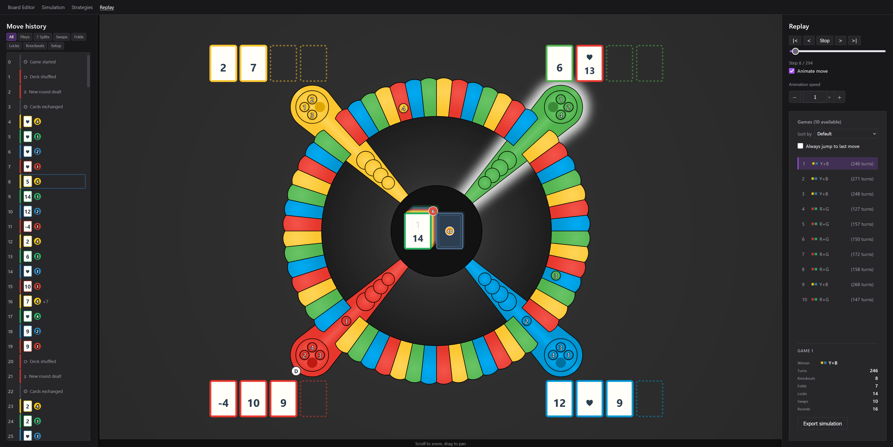

# Partners React

Side project for learning React and TypeScript. I wanted something with enough rules to be interesting but not so big I'd never finish it — PARTNERS fit.

**PARTNERS** is a team board game. Each player has a color and a partner sitting across the table. You get dealt cards, swap one with your partner each round, then play cards to move pawns around a shared track. Bump opponents back to home, get all your pawns into the end zone, lock them in. First team to lock every pawn wins.

This repo is a browser UI on top of a game engine I wrote in `shared/src/`. The engine handles the full rules: dealing, partner exchange, special cards (7-split, swap, start cards, four-back, etc.), knockouts, locks, folds.

## Pages

**Simulation** — Run N games with bots playing against each other. You can change player count, pawns per player, track length, and shuffle mode (`always` vs `when_needed`). Pick a strategy per seat: Random, Smart, Smart+, or a custom preset from the Strategies page.

When a run finishes you get win counts, turn stats, box plots, and per-player breakdowns (knockouts, folds, locks, swaps). Click a game to open it in Replay. Export/import simulation data as JSON.

**Replay** — Step through a single game. The board animates moves; the left panel is the full move history with filters (plays, swaps, folds, locks, knockouts, setup). Scrub with prev/next, play through automatically, change animation speed. Useful for checking whether the engine is doing something dumb.



**Strategies** — Docs for the three bots, plus sliders to tweak Smart/Smart+ scoring weights (progress, bump, start, lock, exposure, partner factor, lockable). Save presets and use them in simulation. The bots are simple heuristics — simulate each legal move, score the result, pick the best. Smart+ adds a bonus for moves that set up an end-zone lock on the next card.

**Board editor** — Tweak board dimensions and colors without running a game. Save/load color themes.

## Run it

```bash
npm install
npm run dev
```

http://localhost:5174

```bash
npm run build
npm run preview
```

## Layout

```
src/              React app (pages, board component, charts)
shared/src/       Game engine — rules, legal moves, simulation, bots
shared/web-ui/    Low-level board rendering helpers
images/           Screenshots
```

Vite aliases: `@/` → `src/`, `@game/` → `shared/src/`, `@web-ui/` → `shared/web-ui/`.

React, TypeScript, Vite, React Router, Chart.js.
